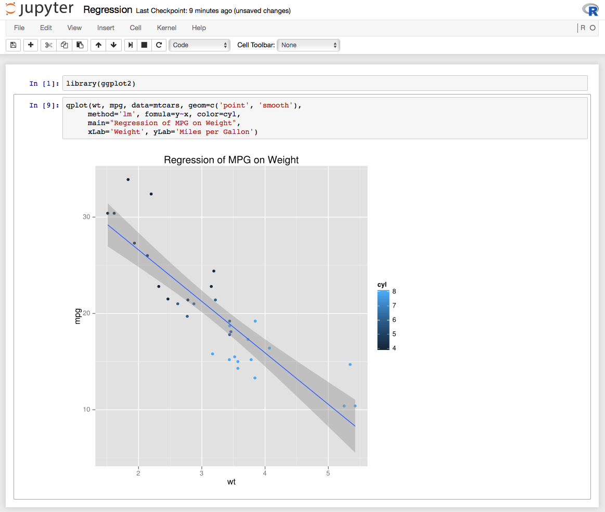

# Deeplearning Toolbox in a Docker Container with NVIDIA GPU

This is one docker container that includes everything you need as a data scientest to build expierements quickly. This contains simple tools like R, numpy and sklearn, and descent deeplearning libraries that run on GPUs like Thenao, Keras, Tensorflow and Torck, and finally Apache Spark 1.5 and you can choose to run it on cluster not just local. So let's get started...

## Requirements
1. A PC or a laptop with Nvidia GPU and linux
2. CUDA driver: https://developer.nvidia.com/cuda-downloads
2. Docker engine: https://docs.docker.com/engine/installation/linux/ubuntulinux/

## Installing the container
```bash
TODO
```

## Build from souce

```bash
git clone git@github.com:dosht/nvidia-toolbox.git
cd nvidia-toolbox
./buildme
./runme
```

To verify installation open [http://localhost:8888/](http://localhost:8888/).

Now, click on new and see the available kernels. You will see Bash, Python2, Python3, R, Scala 2.10.4 (Spark 1.5.2) and iTorch.

## Jupyter for R
R is a free software environment for statistical computing and graphics. It compiles and runs on a wide variety of UNIX platforms, Windows and MacOS.

We can use R in Jupyter via iR kernel: https://github.com/IRkernel/IRkernel



## Jupyter for numpy, sklearn and nltk:

Slklearn: is a simple and efficient tools for data mining and data analysis, accessible to everybody, and reusable in various contexts built on NumPy, SciPy, and matplotlib

NLTK: is a leading platform for building Python programs to work with human language data.

To enable plotting in the notebook, you need to start you notebook at the first cell with:
```python
%pylab inline
```

## Jupyter for Theano, Tensorflow amd Keras

Theano: is a Python library that allows you to define, optimize, and evaluate mathematical expressions involving multi-dimensional arrays efficiently.

TensorFlow: is an open source software library for numerical computation using data flow graphs. Nodes in the graph represent mathematical operations, while the graph edges represent the multidimensional data arrays (tensors) communicated between them.

Keras: is a minimalist, highly modular neural networks library, written in Python and capable of running on top of either TensorFlow or Theano.


## Jupyter for Torch
Torch is a scientific computing framework with wide support for machine learning algorithms that puts GPUs first. It is easy to use and efficient, thanks to an easy and fast scripting language, LuaJIT, and an underlying C/CUDA implementation.

We can use it in Jupyter using iTorch kernel:https://github.com/facebook/iTorch


## Jupyter for Apache Spark


We can use it in Jupyter via spark kernel: https://github.com/ibm-et/spark-kernel


### Spark notebook magics
You can add dependencies to your notebook like this:
```
%AddDeps org.apache.spark spark-streaming-kafka_2.10 1.1.0 --transitive
%AddJar http://example.com/some_lib.jar -f
%AddJar file:/path/to/some/lib.jar
```
And switch on printing Scala types.
```
%showtypes on
```

### Running Spark notebook on a cluster
TODO
